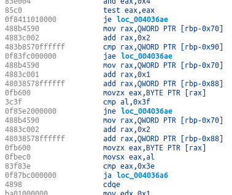

# Software Rot and Classes of Rot Resistances

Something we have all experienced is that our favorite program stops working. Be it an old game at home or our enterprise system at work. This is an example of software rot. *Software rot* is when an unchanged program stops working. Another thing often called software rot is poor maintenance of software. That is rather a question of engineering practices and will not be covered in this article. Here we will talk about unchanged software.

Why does software rot happen and what can be done to avoid it? This article delves into the details.


## Overview
How can something unchanged stop working? Well, a program has dependencies, and when they change enough, the program stops working. This is very common! When a dependency changes can range from weeks to centuries. Before looking at how various dependencies change and cause software rot, let's look at what a program consists of and what kind of dependencies exists.


## Inside Programs
*A computer program* is a sequence of instructions. This is obvious when we look at a binary executable or a shared library. A disassembly of the machine code inside reveals a long list of instructions.



It is less obvious, however, that a piece of C or Python code ultimately is a list of instructions, but it is. Take this example in C:

```
int a, b, c, d;
...
a = b + c * d;
```

First, this gets turned into the following list of statements, `t1` being a new temporary variable.

```
int a, b, c, d, t1;
...
t1 = c * d;
a = b + t1;
```

Then, this gets turned into the following list of instructions. This is Intel syntax x86 assembler:

```
mov eax, [c]
imul eax, [d]
add eax, [b]
```

The bridge between the original C-code and the final x86 instructions is the compiler. The compiler is used to turn C-code into a list of instructions. Thus, the pair consisting of 1) the source code and 2) the compiler can produce a list of instructions. We can regard the original source code as ultimately being a list of instructions.
 
If one is coding based on a programming language standard (Such as C99, formally named ISO/IEC 9899:1999), the bridge between the source code and the instructions is the language specification. Given a collection of source code files, a developer can make a compiler based on the specification that will turn the source code into the intended list of instructions.

What about interpreted languages such as JavaScript? One way of implementing an interpreter is to translate one or a few lines of code to instructions and then execute those instructions. Other ways of implementing interpreters amount to the same thing.

This should make it clear that a computer program ultimately is a list of instructions, whether it is a binary or source code.

### Types of instructions
In the context of software rot and its causes, instructions can be put into one of two classes: 

1) Computational instructions
2) Infrastructure instructions

### Computational instructions
*Computational instructions* are instructions that always give the same result given the same input. They are typically used for calculations or other types of data manipulation. Most instructions are of this kind.

Typical examples are the assembly instructions `mov`, `add`, `sub`, `mul`, `div`, `jXX`, `cmp`. In most programming languages, typical examples are the symbols `=`, `+`, `-`, `*`, `/`. Other examples are `sin`, `cos`, `tan`, `if`, `for`.

### Infrastructure instructions
*Infrastructure instructions* can give different output or result for the same input. They are typically used to talk to other programs or devices, either on the same machine or on external machines. They deal with the infrastructure of a computer or across a network.

Typical examples are the assembly instructions `int`, `in`, `out` and `rdtsc`. These are made available in a programming language through library calls such as `printf`, `read`, `write` and `time`.

Infrastructure instructions are used to talk to the OS (a program on another privilege level), devices such as hard-drives, keyboard, mouse and monitor, and external programs over a network card which also reaches out on the Internet.

It is important to note that an infrastructure instruction in itself does not compute anything. What does something are the computational instructions at the other end of an infrastructure instruction. The infrastructure instructions bridges two programs located different places. For example, `int` calls a program registered as an interrupt handler. `out` and `in` sends and receives data to and from another device that has its own software that will handle the data. `rdtsc` gets the time from a time-device running separately, typically using vibrating quartz crystals or a cesium atomic clock.

Programs can be just computational instructions, or a mix of computational and infrastructure instructions, but rarely only infrastructure instructions. Computational instructions are the substance of a program, while infrastructure instructions bind the computational instructions together across devices (over a network) or hardware barriers (such as privilege levels).

Another interesting aspect of infrastructure instructions is that they are often open or under-specified. An example in assembly is `int 0x10`, which calls the interrupt at location 0x10, whatever that is. Another example is `out 0x43, al` which sends the contents of `al` to port 0x43, whatever is located there. In a programming language `printf`, for example, prints to the standard output, wherever that goes. A call to `write` writes to the file handle 4, whatever that points to. A call to `read` can read data from the disk, whatever is there. A call to `read` can also read the response from a TCP connection, whatever is there. Etc. So, an infrastructure instruction is often loosely bound to a dependency. For example, an executable running on Windows 98 does not work on Windows 8 because interrupt 0x10 no longer prints to the console.


## How Software Rot Happens
Infrastructure instructions are a lot more prone to software rot than computational instructions. Before going into how software rot happens for infrastructure instructions, let's look at how they can occur for computational instructions.

### Software Rot and Computational Instructions
Say we have a dynamic library containing an implementation of a computation.

As an example take a compression library that takes an array of bytes and compresses it to a (hopefully) shorter array of bytes. This library might import other libraries that are also computations. Resolving all dependencies of the compression library yields just computational instructions.

We will now consider some of the most prominent dependencies of such a computational library.

#### 1. Executable Package Format Changes
A library is packaged using a package format. Windows 3.11 used the New Executable (NE) format. On Windows 95, this format is the Portable Executable (PE). On 64-bit versions of Windows, this was changed to PE32+.

On 64-bit Windows, the New Executable (NE) format no longer works. If we look at the program inside the package, it still might work. However, the package format is no longer accepted by Windows, so the software stops working.

#### 2. Language or Instruction Implementation Changes
We have a list of instructions in a binary file or source code files. If the specification of the instructions change, some instructions are no longer supported or the implementation of the compiler changes, the programs might no longer work.

For example, when 64-bit Intel CPUs were launched, they no longer supported a list instructions. If these were used in a library, then the library no longer works.

Another example is a Python 2 program. Python 3 changes what division does. `3/2` in Python 2 is `1`, while in Python 3 it is `1.5`. This change might cause working Python 2 code to no longer work in Python 3.

Another example are the introduction on new keywords, causing new compiler errors because of variables with that name.

Yet another example is the widening of types in C. This causes the length of data types to increase, which again will change the behavior of code using them together with constants defining upper and lower bounds.

Yet another example is the installation of security software on a machine. Certain instructions, sequences of instructions or memory contents can be regarded as suspicious, causing the software to be interrupted. This effectively changes how instructions or a programming language works.

Even though your source code files still works, you compiler might not. A compiler binary might contain instructions that have changed behavior. Thus, your pair of source code and compiler, no longer works as a whole.

#### 3. Library Implementation Changes
A library commonly uses a range of functions from the language library and third party libraries. If one of these libraries change then the software might stop working. This is very common. A common situation is that security updates are bundled with breaking changes. The security fixes makes the update necessary.

### Software Rot and Infrastructure Instructions
Infrastructure instructions are a lot more prone to software rot than computational instructions.

As an example of a program with a mixture of computational and infrastructure instructions, take an online webshop. It interacts with a database, a payment service and a shipping service.

For this kind of software, how can software rot happen?

#### 1. Other Programs on the Same Machine Change
A program uses various services of the operating system such as reading and writing files, creating and synchronizing threads, reading time information, doing inter-process communication (IPC) with other programs. If one of these changes, the program can stop working.

A typical example is that the OS gets an update. This might change the behavior of some OS services. Another example is that another program gets an update changing its behavior. Yet another example is a driver update on the machine. All of these can cause a program to stop working.

#### 2. Device Contents Change
A program often uses the contents of other devices on the machine, the most typical example being the disk. If the contents of the disk changes, the program can stop working. The disk might be full, causing writes to fail. The contents of files might be too large, causing memory to fill up. The contents of the disk might be in an invalid state, causing loads of data to fail. The disk might be broken, causing reads or writes to fail. The rights of a user might be insufficient. All of these can cause a program to stop working.

#### 3. External Services Change
Maybe the most common source of a program to stop working is the change of an external service. Two of the most common causes are 1) an update to an interface causing uses of an older interface to break and 2) the change of security policies, causing a request to be denied. Such events are very common and often cause software to stop working.


## Classes of Software and Their Software Rot Resistance
It should be clear from the above discussion that software rot is different in different software. For example, a compression library written in a clearly defined language will be more resistant to rot than a web application that integrates six external services.

It is also obvious that software doing the same thing can have different rot based on how it is constructed. A compression library can be made more resistant by removing calls to external services or coding it in a more clearly specified programming language.

Let's look more closely at the software rot resistance in different types of software. Let's start with the least resistant type towards the most resistant type.

The classes of rot resistance introduced in this article are called *I1, I2, I3* and *C1, C2, C3*. *I* stands for infrastructure, meaning the software uses infrastructure instructions. *C* stands for computation, meaning the software only contains computational instructions. Software using infrastructure instructions are more prone to software rot than software that only uses computation instructions. The lower the number, the less prone to rot. In other words, rot resistance is `I3 < I2 < I1 < C3 < C2 < C1`.

Let's start with the class most prone to rot, I3, then move towards the class most resistant, C1. For each of the classes, a ballpark estimate is given for the time before rot causes the software to stop working and for the maintenance effort. These estimates are based on experiences with current engineering practices. If the engineering practices change, these number can also change.

### Class I3 - Dependent on External Services
Code dependent on external services usually rots in a few months. This usually happens when an external service changes its interface, address or security policies. Such software requires one or more developers to actively maintain the software.

### Class I2 - Dependent on Device Contents
Software in the I2 class does not have any dependencies on external services. It might be impossible to place a piece of software in this class, but a lot of software can be placed in this class or even lower classes.

Code dependent on the contents of, for example, a disk usually rots after a year. The disk might fill up or it might get files with an invalid state or the wrong state. An example of a wrong state is to have insufficient rights in the OS. Interpreter configurations can change, such as `php.ini`. Such software might require developers to maintain the software. In addition it probably requires a server administrator to free up disk space or grant rights.

### Class I1 - Dependent on Services on the Same Computer
Software in the I1 class does not have any dependencies on external services or on device contents, such as disk contents. It does use OS-services, such as threading and synchronization or device input and output, or interacts with other programs through inter process communication (IPC) or a loop-back network interface.

Such software usually rots in a few years. This happens when the OS gets an update or other software on the machine gets updated, breaking the interface. Such software requires a part-time developer to update the code using the outdated interface.

### Class C3 - Dependent on Language Implementation
Software in the C3 class has no infrastructure instructions at all nor does any of its dependencies. It is sequences of computational instructions. An example is a dynamically linked library (DLL) or shared library (SO) containing various computations, or a collection of C or Python source code with computations.

This kind of software usually rots after a decade. The most common example is a change in the programming language standard. This often includes breaking changes. Another example is a change in the garbage collection algorithm, causing memory to fill up or become too slow. Yet another example is the change in implementation-defined behavior, common to many languages, for example, C and C++.

### Class C2 - Dependence on Language Specification
Software in the C2 class can be run on a specification-compatible platform or compiled with a standard-compliant compiler. It has no dependencies on a specific implementation. Examples for CPUs are AMD and Intel x86 CPUs. Examples for C99 are GNU C, Microsoft C Compiler and Intel C compiler.

Such software usually rots after a few decades. What happens is that a language standard is no longer supported on modern hardware or operating systems. This causes the software to no longer be compilable. The language might be so old that few developers are interested working on it because of career concerns. The language probably is archaic and it is taught only a few places and few people even understand the code. Examples of this is code written in COBOL or MIPS assembly.

### Class C1 - Dependence on the Proven
Software in the C1 class is programmed using only proven programming language constructs. That a language construct is proven means that it has been successfully used in a wide variety of software and that it is as simple as possible causing it to be highly understandable.

An example of this is code written using [progsbase](https://www.progsbase.com). This is a programming language containing only the proven, solid programming constructs. It therefore does not include new and experimental constructs that is unknown whether will last for many decades. Examples of programs written with progsbase are available in the [progsbase repository](https://repo.progsbase.com). The progsbase toolchain has code analysis tools for ensuring your program is in class C1.

Code written using proven, solid constructs might rot after centuries. For it to rot, a fundamentally new technology must replace today's computers, and computers like we have today must be regarded like typewriters are today: They are replaced with something so superior nobody cares about computers any more.

For a programming language to be in class C1 must be so simple a developer can reimplement it in a relatively short time and that is almost guaranteed to succeed. The programming language must also be so fundamental it remains core programming knowledge, something every software developer must know to practise software engineering.

### Summary of Classes
Below is a table of each class and rot resistance times. This table contains ballpark averages for when software rot causes a program to stop working. The maintenance figures are ballpark averages of the yearly work to maintain the software because of software rot. Work required to add or change features of the software is not included as this is not the topic of this article.

| Class | Technology Example        | Rot-resistance (ballpark average)  | Maintenance a year (ballpark average)  |
|-------|---------------------------|------------------------------------|--------------------------|
| C1    | progsbase                 | centuries                          | a developer day          |
| C2    | C89 or Python 2           | a few decades                      | a developer week         |
| C3    | C or Python               | a decade                           | a developer month        |
| I1    | C or Python + OS services | a few years                        | a developer 50%          |
| I2    | C or Python + HDDs        | a year                             | developer + server admin |
| I3    | C or Python + network     | a few months                       | a team                   |


## Developing with the Right Rot Resistance
New software should be developed for the right rot resistance class. For example, a core banking system will last for many decades, and its core computations should be placed in the most rot resistant class. Further examples are core computations of insurance, transport reservation, air traffic control, energy distribution, power plants, military defense, cartography, standard libraries. It also advisable for core libraries of sciences such as physics, mathematics, biology, economics and computer science.

An existing software system will most likely be in class I3. However, parts of the system probably are in different classes, as much as 80% of it in C3 and I1, which makes it within a relatively short distance of C1, the most rot resistant class.

## Improving the Rot Resistance
Software modules might be unnecessarily rot prone. An example from the [progsbase blog](https://www.progsbase.com/featuredpost/industrial-case-replacing-a-barcode-solution-at-inkeria/) took a barcode system all the way from I3 to C1, but it would be still be interesting to only take it to C2. This is a summary:

A barcode generation solution was implemented in JavaScript and had to be invoked in the client browser and stored on the server. This is clearly class I3. The rot resistance was improved as follows:

The infrastructure instructions were removed, as they were unnecessary, and the barcode generation was reduced to a computation implemented in progsbase: C1. This greatly improved rot resistance of this part of the software and greatly expanded its flexibility as it could now gain additional benefits of progsbase, such as being translatable to other programming languages.

One can often easily tell if a software module is unnecessarily prone to software rot. Software such as barcode generation is essentially a computation, so it should at least be in the C-series of software rot resistance. For some software to necessarily be in the I-classes, it must require OS-services, disk contents or external services to run. It should only be in the I-series of classes if it is necessary.


## Why do Dependencies Change
Dependencies change because a breaking change was considered necessary or desirable enough to warrant the break.

There are some prominent examples of somewhat forward compatible systems: Microsoft Windows, Intel's x86 and the C programming language. There are binaries that run on Windows 3.11 that still run on 32-bit Windows 10. There are C89 programs written in the 90s that still compiles. There are sequences of x86 instructions that produce the same result in x86-64.

The forward compatibility maintained in these systems is controversial, but they remain large actors in their respective fields.

At the other end are modern web services. Changing several times a year is considered dynamic and adaptable.

Creating forward compatibility is difficult, and it is generally considered unattainable. The gleeful rejection of forward compatibility in the development culture causes dependencies to change and change often, causing the short rot time for the I3 class.


## Conclusion
If you want software to continue working for a long time, you should develop it for the most rot resistant class possible. If you have existing software, you should see if its rot resistance class can be improved by reducing rot prone dependencies.
